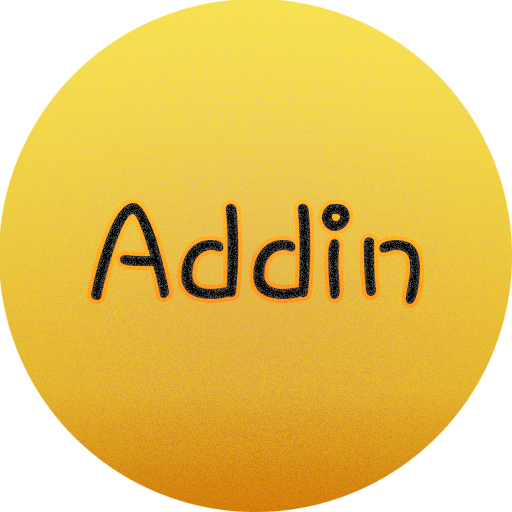

<!-- PROJECT SHIELDS -->
<!--
*** I'm using markdown "reference style" links for readability.
*** Reference links are enclosed in brackets [ ] instead of parentheses ( ).
*** See the bottom of this document for the declaration of the reference variables
*** for contributors-url, forks-url, etc. This is an optional, concise syntax you may use.
*** https://www.markdownguide.org/basic-syntax/#reference-style-links
-->
<!--
[![Contributors][contributors-shield]][contributors-url]
[![Forks][forks-shield]][forks-url]
[![Stargazers][stars-shield]][stars-url]
[![Issues][issues-shield]][issues-url]
[![MIT License][license-shield]][license-url]
[![LinkedIn][linkedin-shield]][linkedin-url]
-->


<!-- PROJECT LOGO -->
<br />
<p align="center">
  <a href="https://github.com/Edgarborras94/Addin">
    
  </a>

  <h3 align="center">Addin.js</h3>

  <p align="center">
    Adding items to DOM list never been easier
    <br />
    <!--<a href="https://github.com/othneildrew/Best-README-Template"><strong>Explore the docs »</strong></a>
    <br />
    <br />-->
    <a href="https://codepen.io/edgarborras94/pen/KKzZYRM">View Demo</a>
    ·
    <a href="https://github.com/Edgarborras94/Addin/issues">Report Bug</a>
    ·
    <a href="https://github.com/Edgarborras94/Addin/issues">Request Feature</a>
  </p>
</p>


<!-- TABLE OF CONTENTS -->
<!--
## Table of Contents

* [About the Project](#about-the-project)
  * [Built With](#built-with)
* [Getting Started](#getting-started)
  * [Prerequisites](#prerequisites)
  * [Installation](#installation)
* [Usage](#usage)
* [Roadmap](#roadmap)
* [Contributing](#contributing)
* [License](#license)
* [Contact](#contact)
* [Acknowledgements](#acknowledgements)


## About The Project

[![Product Name Screen Shot][product-screenshot]](https://example.com)

There are many great README templates available on GitHub, however, I didn't find one that really suit my needs so I created this enhanced one. I want to create a README template so amazing that it'll be the last one you ever need.

Here's why:
* Your time should be focused on creating something amazing. A project that solves a problem and helps others
* You shouldn't be doing the same tasks over and over like creating a README from scratch
* You should element DRY principles to the rest of your life :smile:

Of course, no one template will serve all projects since your needs may be different. So I'll be adding more in the near future. You may also suggest changes by forking this repo and creating a pull request or opening an issue.

A list of commonly used resources that I find helpful are listed in the acknowledgements.
-->
### Built With
Addin is made purely in Javascript
* [Javascript](https://www.javascript.com/)


<!-- GETTING STARTED -->
## Getting Started

Just follow these simple steps

### Prerequisites

You need bootstrap to use all the power of Addin 😎

### Installation

1. Get a copy of one of the .js on the dist folder
2. Import it in your file
3. Create a div to hold Addin
```HTML
<div id="addedjs">
</div>
```
3. Simply instante it
```JS
var list = new Addin('addedjs'); //default -> english
```
4. That's it! 😁👌


<!-- USAGE EXAMPLES -->
## Usage

-Simple usage:
```
...
<div class="addindiv">
</div>
...
<!--Import the script-->
<script src="/js/adding.min.js">
<!--Initialize Addin -->
<script>
var addin = new Addin('addindiv');
</script>
<!--Just it 😁-->
```

-Some Customization & Spanish:
```
...
<div class="addindiv">
</div>
...
<!--Import the script-->
<script src="/js/adding.min.js">
<!--Initialize Addin -->
<script>
var list = new Addin('addindiv',
    {
        // Values
        initialValue : 0,
        
        // Classes & IDs
        superParentDivClass: 'addobjectsesp',
        parentDivClass: 'addedesp', //<-- This will add a number after the classname ie: added0
        parentDivExtraClasses: 'col-sm-12',
        fieldName: 'addobjectesp',
        fieldClass: 'addjsesp',
        fieldExtraClasses: 'form-control',
        addButtonClasses: ['btn','btn-success'],
        removeButtonClasses: ['btn','btn-danger'],


        // Strings -> Translatable??

        strings: {
            buttons: {
                add: 'Añadir',
                remove: 'Eliminar',
            },
            empty: 'No se ha añadido ningún curso',
            itemName: 'Curso',
            itemPlaceholder: 'Nombre del curso'
        }

        }
    ); //Demo en español
</script>
<!--Just it 😁-->
```
-Super Customization (use {loop} variable to differenciate objects os yout custom element):
```
...
<div class="addindiv">
</div>
...
<!--Import the script-->
<script src="/js/adding.min.js">
<!--Initialize Addin -->
<script>
var list = new Addin('addedjsespcustom',
    {

        // Values
        initialValue : 0,
        object: `<div class="card">
                        <div class="card-body">
                        <div class="form-group ">
                            <label class="form-control-label" for="input-{loop}">{loop}</label>
                            <input type="text" name="{loop}" id="input-{loop}" class="form-control {loop}" placeholder="{loop}" value="{loop}">
                        </div>
                        <div class="form-group ">
                            <label class="form-control-label" for="input-{loop}2">2{loop}</label>
                            <input type="text" name="2{loop}" id="input-{loop}2" class="form-control 2{loop}" placeholder="2{loop}" value="2{loop}">
                        </div>
                        </div>
                        </div>`,
        // Classes & IDs
        superParentDivClass: 'addobjectsespcustom',
        parentDivClass: 'addedespcustom', //<-- This will add a number after the classname ie: added0
        parentDivExtraClasses: 'col-sm-12',
        fieldName: 'addobjectespcustom',
        fieldClass: 'addjsespcustom',
        fieldExtraClasses: 'form-control',
        addButtonClasses: ['btn','btn-success'],
        removeButtonClasses: ['btn','btn-danger'],


        // Strings -> Translatable??

        strings: {
            buttons: {
                add: 'Añadir',
                remove: 'Eliminar',
            },
            empty: 'No se ha añadido ningún curso',
            itemName: 'Curso',
            itemPlaceholder: 'Nombre del curso'
        }

        }
    ); //Demo en español con custom object
</script>
<!--Just it 😁-->
```

You can view the [DEMO](https://codepen.io/edgarborras94/pen/KKzZYRM) to see 3 fully working usages


<!-- ROADMAP -->
## Roadmap

See the [open issues](https://github.com/Edgarborras94/Addin/issues) for a list of proposed features (and known issues).


<!-- CONTRIBUTING -->
## Contributing

Contributions are what make the open source community such an amazing place to be learn, inspire, and create. Any contributions you make are **greatly appreciated**.

1. Fork the Project
2. Create your Feature Branch (`git checkout -b feature/AmazingFeature`)
3. Commit your Changes (`git commit -m 'Add some AmazingFeature'`)
4. Push to the Branch (`git push origin feature/AmazingFeature`)
5. Open a Pull Request


<!-- LICENSE -->
## License

Distributed under the MIT License. See `LICENSE` for more information.


<!-- CONTACT -->
## Contact

Edgarborras94 - [@edgar_94_](https://twitter.com/edgar_94_) - edgarborras94@gmail.com
<!--
Project Link: [https://github.com/your_username/repo_name](https://github.com/your_username/repo_name)
-->


<!-- ACKNOWLEDGEMENTS -->
<!--
## Acknowledgements
* [GitHub Emoji Cheat Sheet](https://www.webpagefx.com/tools/emoji-cheat-sheet)
* [Img Shields](https://shields.io)
* [Choose an Open Source License](https://choosealicense.com)
* [GitHub Pages](https://pages.github.com)
* [Animate.css](https://daneden.github.io/animate.css)
* [Loaders.css](https://connoratherton.com/loaders)
* [Slick Carousel](https://kenwheeler.github.io/slick)
* [Smooth Scroll](https://github.com/cferdinandi/smooth-scroll)
* [Sticky Kit](http://leafo.net/sticky-kit)
* [JVectorMap](http://jvectormap.com)
* [Font Awesome](https://fontawesome.com)
-->


<!-- MARKDOWN LINKS & IMAGES -->
<!-- https://www.markdownguide.org/basic-syntax/#reference-style-links -->
<!--
[contributors-shield]: https://img.shields.io/github/contributors/othneildrew/Best-README-Template.svg?style=flat-square
[contributors-url]: https://github.com/othneildrew/Best-README-Template/graphs/contributors
[forks-shield]: https://img.shields.io/github/forks/othneildrew/Best-README-Template.svg?style=flat-square
[forks-url]: https://github.com/othneildrew/Best-README-Template/network/members
[stars-shield]: https://img.shields.io/github/stars/othneildrew/Best-README-Template.svg?style=flat-square
[stars-url]: https://github.com/othneildrew/Best-README-Template/stargazers
[issues-shield]: https://img.shields.io/github/issues/othneildrew/Best-README-Template.svg?style=flat-square
[issues-url]: https://github.com/othneildrew/Best-README-Template/issues
[license-shield]: https://img.shields.io/github/license/othneildrew/Best-README-Template.svg?style=flat-square
[license-url]: https://github.com/othneildrew/Best-README-Template/blob/master/LICENSE.txt
[linkedin-shield]: https://img.shields.io/badge/-LinkedIn-black.svg?style=flat-square&logo=linkedin&colorB=555
[linkedin-url]: https://linkedin.com/in/othneildrew
[product-screenshot]: images/screenshot.png
-->
